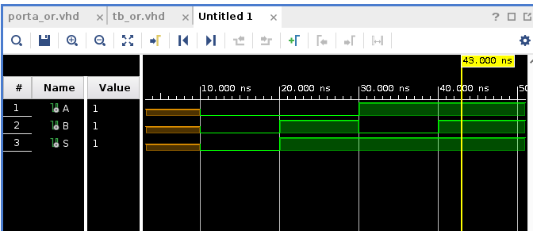
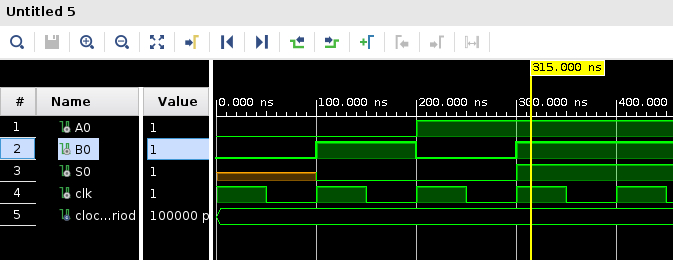
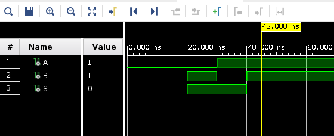
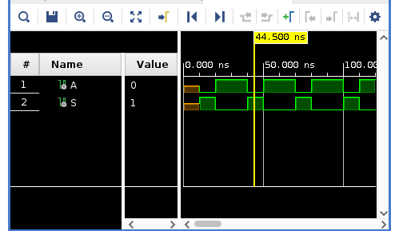
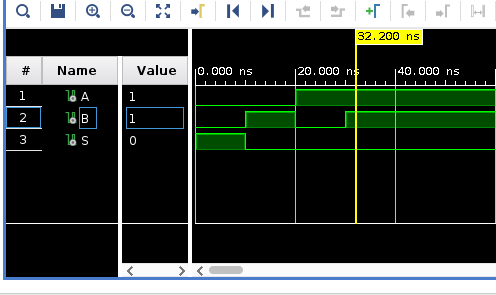
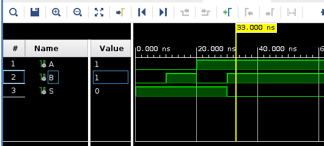
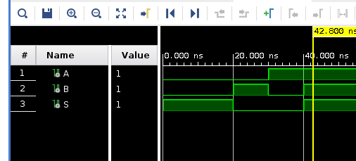

# Simulações usando o Vivado 2020.2

## Simulação da porta OR

## Simulação da porta AND com clock

## Simulação da porta XOR

## Simulação da porta Inverter

## Simulação da porta NOR

## Simulação da porta NAND

## Simulação da porta XNOR

