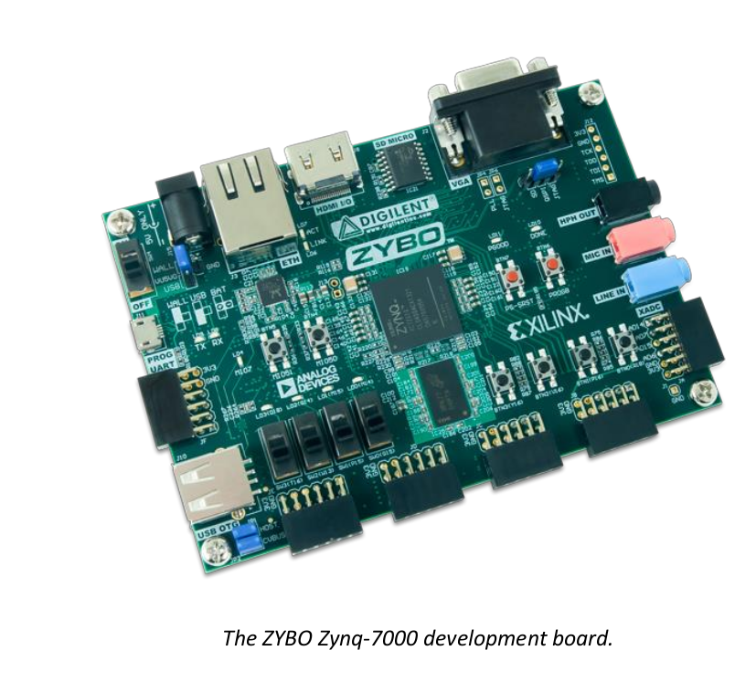
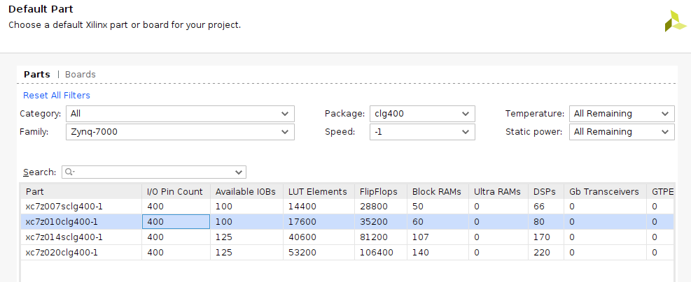

# sistemas-digitais-2023.1

Repositório dedicado às atividades da disciplina de Sistemas Digitais para Computadores, na UFC - campus Quixadá.

## Ambiente de Desenvolvimento

- Xilinx Vivado 2020.2

- Linguagem VHDL

- Linux POP!_OS 22.04 LTS

## Embedded Target

